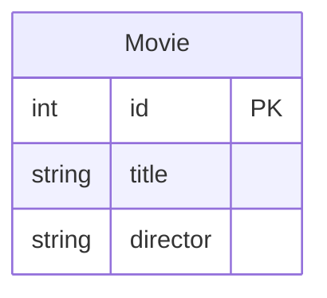

[](https://classroom.github.com/a/8TvOoJPN)
# Myapp Template


Welcome to the `myapp` app! Please use this as a template to create your own app

- SQLite - An embedded database to store all our movies
- Python - A fantastic, simple language we use to communicate with our database
- [SQLModel](https://sqlmodel.tiangolo.com/) - A python library that allows you to communicate with your database. This is an Object Relational Mapping (ORM) library.
- [Textual](https://textual.textualize.io/) - An awesome Terminal Movie Interface (TUI) that allows us to draw interactive graphics on our terminal
- [Prompt-toolkit](https://github.com/prompt-toolkit/python-prompt-toolkit) - An awesome library that allows you one to create a custom Read-Evaluate-Print-Loop (REPL) 


## Installation

Just type in `pip install -e .`
## Running the Demo

There are three (3) applications we created to interact with our database. Open up your terminal/shell and type one of the following commands:

1. `myapp-create-db` - This will create the database for us. This must be executed at least one time before any other command. The database will be stored in `src/myapplist/database/database.db`
2. `myapp-repl` - This will launch the **repl** app. You will issue commands by entering them into the repl.
3. `myapp-tui` - This will launch the **tui** app. You issue commands by clicking the widgets in your terminal.


`myapp-repl` and `myapp-tui` have the same capabilities when it comes to adding worklists and tasks. They are just different frontends to talk to the database. 

**Clear Tables and Data**

Anytime you want to clear the database and start fresh, just type `myapp-create-db` into your shell.

## Database Design

There are two tables created in this app: `Movie`



## Walkthrough

All the main code lives inside the folder `src/myapp`:

```
myapp
├─ tui
│  ├─ widgets
│  │  └─ select.py
│  ├─ style.css
│  └─ app.py
├─ repl
│  ├─ helper.py
│  ├─ console.py
│  └─ app.py
├─ db.py
└─ database
   ├─ database.db
```

Let's talk about each section.

### `database`

The database folder holds the file `database.db`. This is a SQLite database file that stores all the data for our app. YOu can open this database with Beekeeper or even SQLite[ browser](https://sqlitebrowser.org/). 

### `db.py`

This is our python module that contains the definition of the tables in our database. We are using SQLModel to define the tables. For example

```python
class Movie(SQLModel, table=True):  # 
    id: Optional[int] = Field(default=None, primary_key=True)  # this will autoincrement by default
    title: str
    director: str 
```
defines a class called Movie that inherits from SQLModel. This will ensure that a table called `movie` may be created. The data types of the fields are the type hints in Python.

We also create helper functions that help us talk to the database:

```python
def get_movies() -> List[Movie]:
    with Session(engine) as session:
        return list(session.query(Movie).all())
```

This functions creates a `Session` with our database where we can query all the rows in the Movie table. Usually you would do this with SQL like:

```sql
SELECT *
FROM movie
```

However, the ORM allows us to do this all within Python (and the ORM handles writing SQL). This function will return a list of Movie objects (the rows in our table).


### repl

The repl is created using prompt-toolkit. The main application is under the file `app.py`. The files `console.py` and `helper.py` provide function and objects that the help `app.py`.

The basic idea is we have a while loop that repeatedly asks for commands. We execute those commands (which are often reading or writing to the database) and loop again.

### tui

This folder contains all the code for the tui interface. The main app is inside the file `app.py`. All the *styles* of the app, which configure how the app *looks*, are in `style.css`. This is a much more advanced interface than the `repl` interface.


